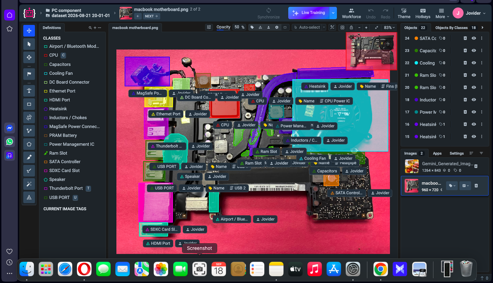
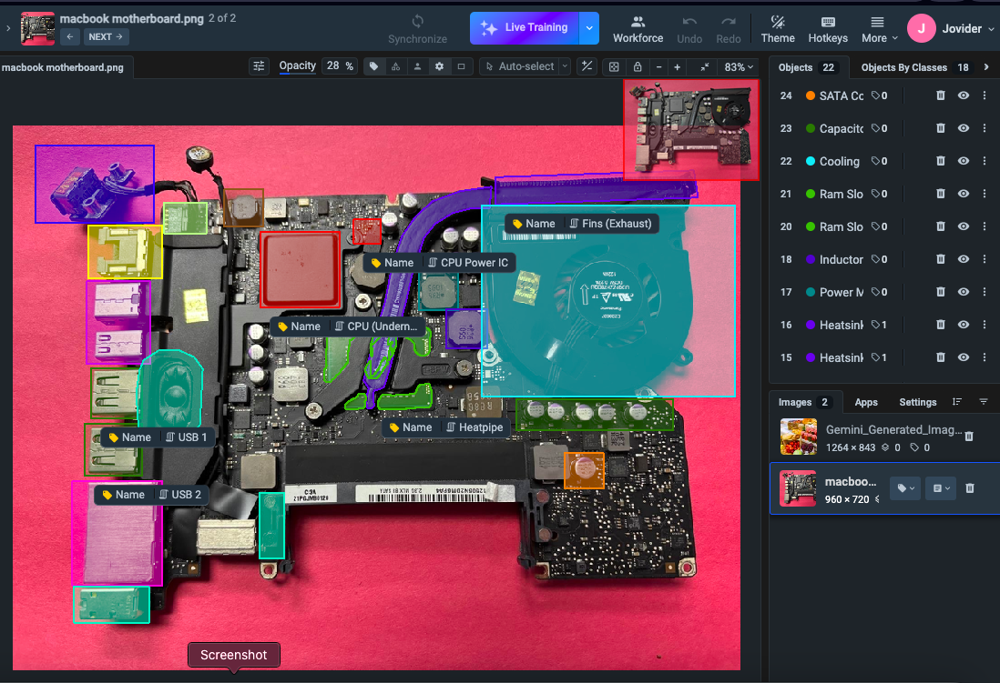
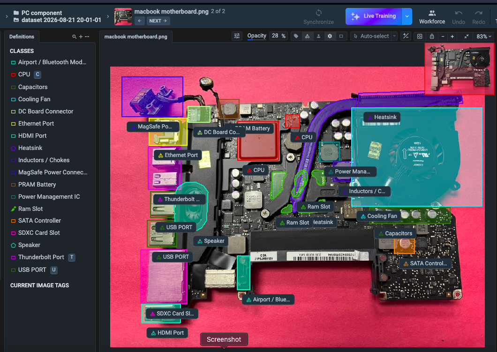
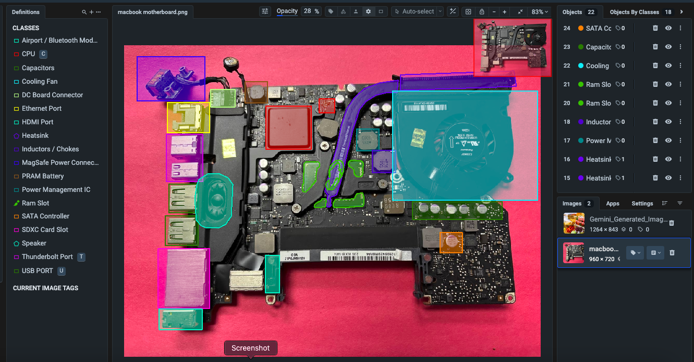
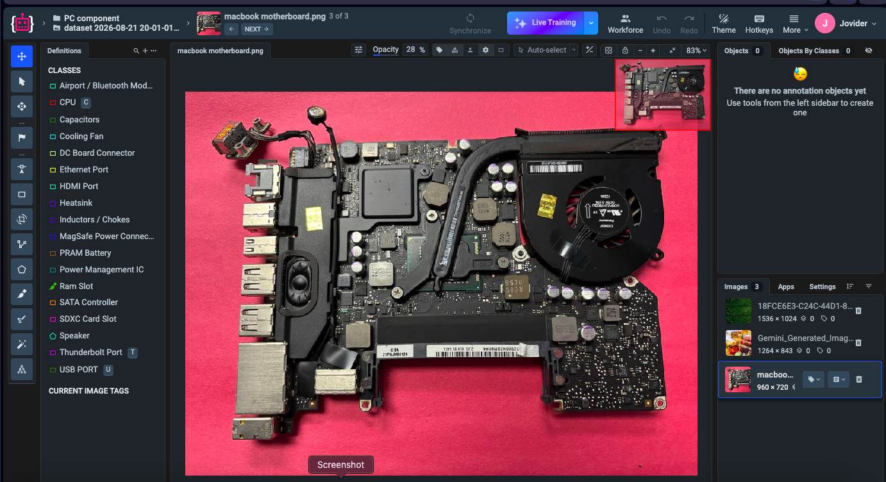
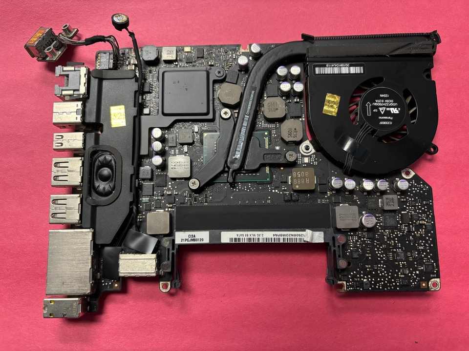

# Image Annotation Portfolio

## MacBook Logic Board Component Annotation & Computer Vision Labeling

This project shows my hands-on experience with image annotation and computer vision labeling for AI and machine learning datasets.

My work involved reviewing a detailed image of a MacBook logic board, identifying individual hardware components, assigning the correct component classes, and creating accurate annotations around each object using Supervisely.

The task required careful attention to small and closely positioned components, accurate class selection, and consistent annotation across the image.

---

## Project Overview

**Annotation Type:** Image Annotation / Computer Vision Labeling  
**Data Type:** MacBook Logic Board Image  
**Platform:** Supervisely  
**Focus:** Hardware Component Detection & Classification  
**Task:** Identify, classify, and accurately annotate individual components on the logic board  
**Quality Focus:** Annotation accuracy, class accuracy, object coverage, consistency, and edge-case review

The goal was to identify and label visible components of the MacBook logic board so the annotated image could be used as structured training data for computer vision applications.

---

## Components Annotated

The logic board contains many different components positioned close to one another. I identified and annotated multiple component classes, including:

<ul class="skill-list">
  <li>CPU</li>
  <li>RAM</li>
  <li>Heatsink</li>
  <li>Cooling Fan</li>
  <li>Capacitors</li>
  <li>Inductors / Chokes</li>
  <li>DC Board Connector</li>
  <li>Ethernet Port</li>
  <li>HDMI Port</li>
  <li>USB Port</li>
  <li>Thunderbolt Port</li>
  <li>SDXC Card Slot</li>
  <li>Speaker</li>
  <li>MagSafe Power Connector</li>
  <li>Airport / Bluetooth Module</li>
  <li>Power Management Components</li>
  <li>SATA Controller</li>
  <li>Other Visible Board Components</li>
</ul>

Each component was assigned to the appropriate class based on the annotation guidelines and the visible structure of the logic board.

---

## Annotation Approach

The project required different annotation shapes depending on the size and structure of each component.

For larger or regularly shaped components, I created annotations that clearly covered the target object while avoiding unnecessary surrounding areas.

For smaller, irregular, or closely positioned components, I reviewed the image carefully and adjusted the annotation to better follow the visible component boundaries.

I also made sure that nearby components belonging to different classes were annotated separately rather than being combined into a single object.

---

## My Annotation Workflow

1. Review the available annotation classes and project guidelines.
2. Inspect the complete logic board image before beginning annotation.
3. Identify each visible hardware component.
4. Select the correct class for the component.
5. Create the appropriate annotation around the object.
6. Adjust the annotation to accurately represent the visible component.
7. Continue through the image while checking for smaller or easily missed objects.
8. Review overlapping and closely positioned components carefully.
9. Confirm that each annotation has the correct class.
10. Perform a final quality review before completing the task.

---

## Sample Annotation Work

Below is a video demonstration and supporting screenshots from my MacBook logic board image annotation project in Supervisely.

### Example 1: Completed Annotation Video Demonstration

<video controls width="100%">
  <source src="screenshots/video-0001.MP4" type="video/mp4">
</video>

<a class="link-card featured-project-link" href="screenshots/video-0001.MP4">View Full Annotation Video</a>

This video shows the completed MacBook logic board annotation project and provides a closer look at my work inside the annotation interface.

In the demonstration, I navigate around the completed image, zoom in and out to inspect individual components, hide and restore tags and class information, and review the annotation boundaries across different parts of the logic board.

The video provides a clearer view of the completed annotation and how the individual hardware components were identified and labeled.

---

### Example 2: Full Annotation View

This view shows the completed annotation workspace with component classes, object labels, and annotations visible across the MacBook logic board.

### Example 3: Annotation Tags View

This view highlights the annotated components and their associated tags, showing how object information was organized within the annotation interface.

### Example 4: Classes View

This view shows the different component classes used throughout the project, including CPU, cooling fan, heatsink, RAM slot, ports, connectors, capacitors, and other hardware components.

### Example 5: Annotation Without Tags or Classes

This view provides a cleaner look at the annotation boundaries without the additional class and tag labels covering the image.

### Example 6: Labels Hidden

This view shows the annotated regions with labels hidden, making it easier to inspect the placement and boundaries of the annotations across the logic board.

### Example 7: Original Image

This is the original MacBook logic board image before annotation, providing a comparison between the raw image and the completed labeled version.

---

## Quality Assurance

Before completing the annotation work, I check for:

- Missing components
- Incorrect class assignments
- Inaccurate object boundaries
- Annotations covering unnecessary background areas
- Accidentally combined objects
- Duplicate annotations
- Small components that may have been overlooked
- Consistency between similar component classes
- Correct annotation of closely positioned objects
- Overall annotation completeness

When a component is difficult to identify or its boundary is unclear, I review the surrounding area and available project classes carefully before making the final annotation decision.

---

## Skills Demonstrated

<ul class="skill-list">
  <li>Image Annotation</li>
  <li>Computer Vision Labeling</li>
  <li>Object Detection</li>
  <li>Instance Segmentation</li>
  <li>Multi-Class Annotation</li>
  <li>Object Classification</li>
  <li>Hardware Component Annotation</li>
  <li>Annotation Boundary Review</li>
  <li>Guideline Interpretation</li>
  <li>Edge-Case Review</li>
  <li>Data Quality Review</li>
  <li>Quality Assurance</li>
</ul>

---

## Annotation Tool

This project was completed using:

<ul class="skill-list">
  <li>Supervisely</li>
</ul>

I am also experienced with other annotation platforms and can adapt to custom tools, project-specific class structures, and different annotation guidelines.

---

## Back to Portfolio

<a class="link-card featured-project-link" href="../">Back to Annotate with Joe</a>

## The materials shown here are presented only as examples of my annotation skills and workflow. Sensitive client or project information is not included.
