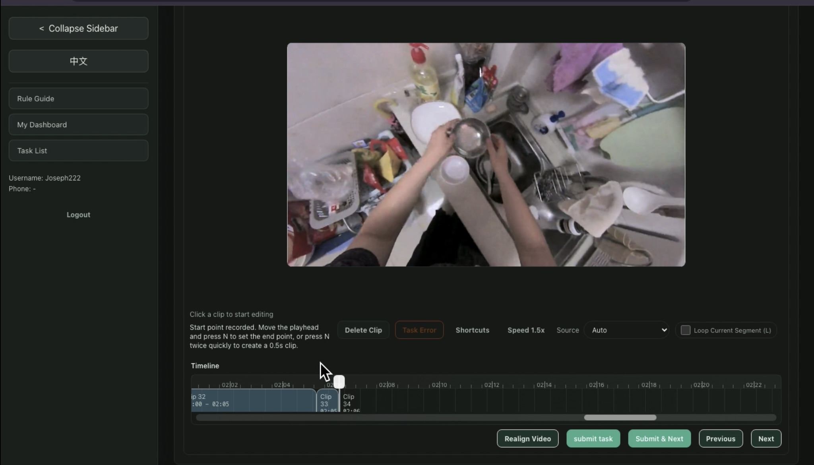
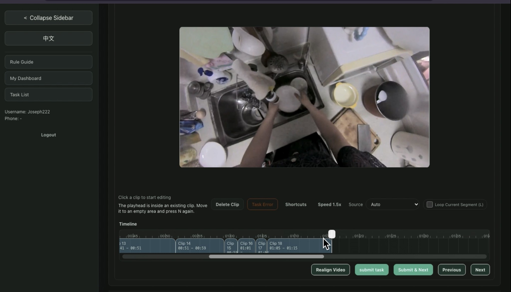
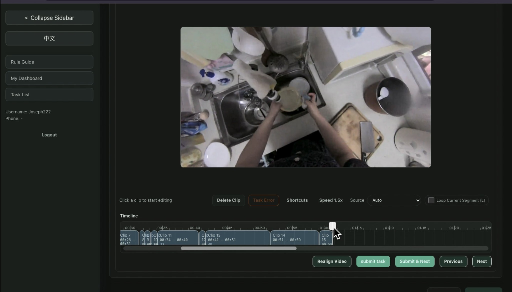
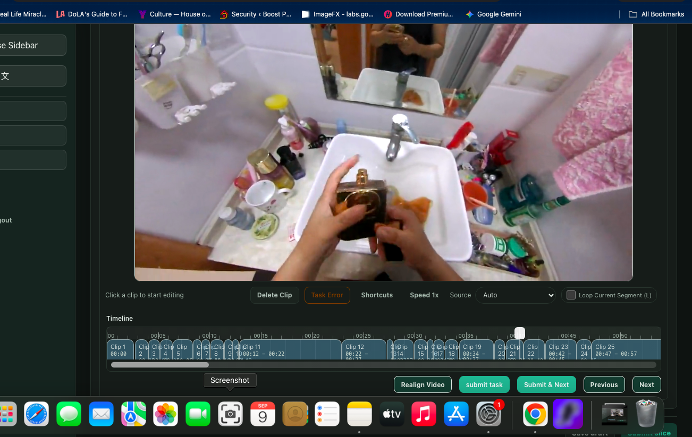
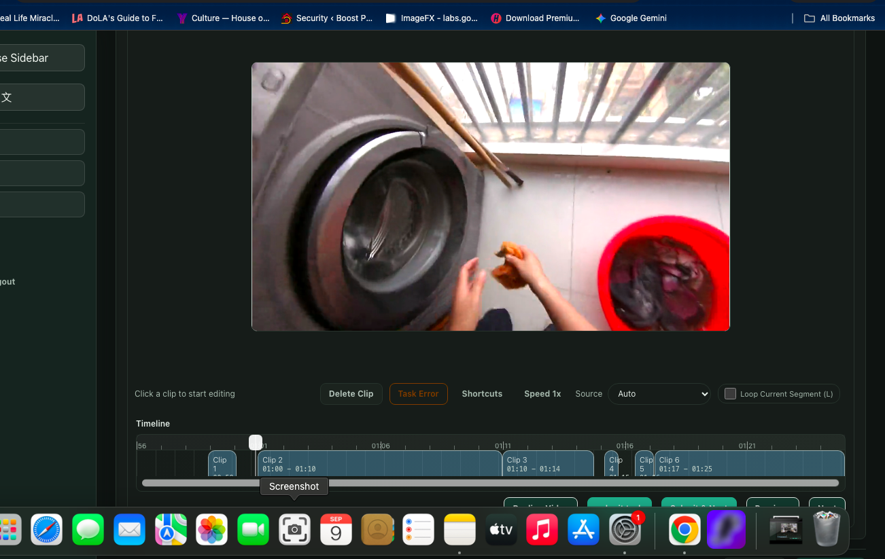

# Video Annotation Portfolio

## Atomic-Level Video Segmentation & Human-Object Interaction Annotation

This project showcases my hands-on experience with video annotation and temporal segmentation for AI and machine learning datasets.

My work involved reviewing first-person video footage, identifying meaningful human actions, and dividing continuous videos into accurate atomic-level action segments based on detailed annotation guidelines.

---

## Project Overview

**Annotation Type:** Video Segmentation / Temporal Annotation  
**Data Type:** First-Person (Egocentric) Video  
**Focus:** Human-Object Interaction & Atomic Actions  
**Task:** Identify accurate start and end boundaries for individual actions  
**Quality Focus:** Boundary accuracy, guideline compliance, consistency, and edge-case handling

The goal was to convert continuous video footage into short, meaningful action segments that could be used as structured training data.

---

## Annotation Guidelines

The project followed detailed segmentation rules. Some of the main principles I applied included:

- One main action per segment
- Each segment should represent a complete atomic-level action
- Independent actions should be separated into different segments
- Segment boundaries should match the actual beginning and end of an action
- The relevant hand should remain sufficiently visible during the action
- Long continuous actions should be divided according to the specified duration limits
- Changes in action or object state may require a new segment
- Continuous movements belonging to the same action should not be unnecessarily over-segmented

For example, a sequence such as:

**Pick up object → carry object → put down object**

would be reviewed as separate meaningful actions rather than automatically treating the entire sequence as one segment.

---

## My Annotation Workflow

1. Review the annotation guidelines before beginning a task.
2. Watch or scrub through the full video to understand the activity.
3. Identify the beginning of a meaningful atomic action.
4. Mark the appropriate start boundary.
5. Follow the action until it ends or transitions into another action.
6. Mark the end boundary and create the segment.
7. Continue through the video while separating distinct actions.
8. Review unclear or borderline cases against the guidelines.
9. Perform a final quality check before submission.

---

## Sample Annotation Work

The screenshots below show examples of my temporal segmentation work. The timeline contains multiple clips created by identifying action transitions and defining their start and end boundaries.

### Example 1 — Multi-Action Segmentation

This example shows a continuous first-person activity divided into multiple temporal segments along the video timeline.

### Example 2 — Segment Boundary Review

Segment boundaries are placed around meaningful actions while maintaining continuity and avoiding unnecessary splitting.

### Example 3 — Extended Activity Segmentation

Longer sequences require continued review of action changes, object interactions, and segment duration throughout the video.

### Example 4 — Different Environment

This sample demonstrates the same annotation methodology being applied to a different activity and environment.

### Example 5 — Object Interaction

The annotation process focuses on identifying meaningful hand and object interactions and separating them into appropriate temporal segments.

---

## Video Demonstration

A sample video demonstrating the annotation workflow is included in this repository.

▶️ **[View Video Annotation Sample](videos/video-annotation-04.mp4)**

The video provides a clearer view of how continuous footage is divided into individual action segments.

---

## Quality Assurance

Before submitting annotated work, I check for:

- Accurate start and end boundaries
- Missed actions
- Incorrectly combined actions
- Unnecessary segmentation
- Segment duration requirements
- Hand/action visibility
- Correct interpretation of project guidelines
- Consistency across the complete video

When an action is unclear, I review the surrounding frames and compare the situation against the project guidelines before making a final annotation decision.

---

## Skills Demonstrated

- Video Annotation
- Temporal Segmentation
- Atomic Action Segmentation
- Human-Object Interaction Analysis
- Frame-Level Review
- Action Boundary Detection
- Guideline Interpretation
- Edge-Case Review
- Data Quality Assurance
- Annotation Quality Control

---

## Annotation Tools

I have experience working with annotation platforms and tools including:

- Supervisely
- CVAT
- Labelbox
- Label Studio

I am also comfortable learning custom annotation platforms and adapting to project-specific workflows and guidelines.

---

## Additional Screenshots

More examples from the project are available in the [`screenshots`](screenshots/) folder.

---

> **Portfolio Note:** The materials shown here are presented only as examples of my annotation skills and workflow. Sensitive client or project information is not included.
